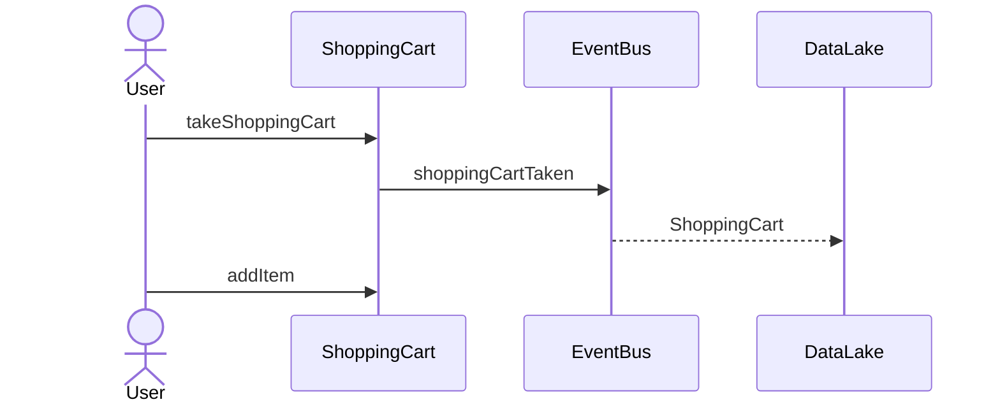

#### Jenkins Workflows
- [Main (dev/test)]()
- [Release (accept/prod)]()

#### Service URL's

| Tool       | URL                                                          |
|------------|--------------------------------------------------------------|
| Swagger    | [http://localhost:8084/swagger-ui/index.html](http://localhost:8084/swagger-ui/index.html) |
| Monitoring | [https://dynatrace.webshop.com/shopping-carts](https://dev/) |
| Logs       | [https://kibana.webshop.com/shopping-carts](https://dev/)    |
| Bugs       | [https://jira.webshop.com/shopping-carts](https://dev/)      |

#### Main Business Workflow

